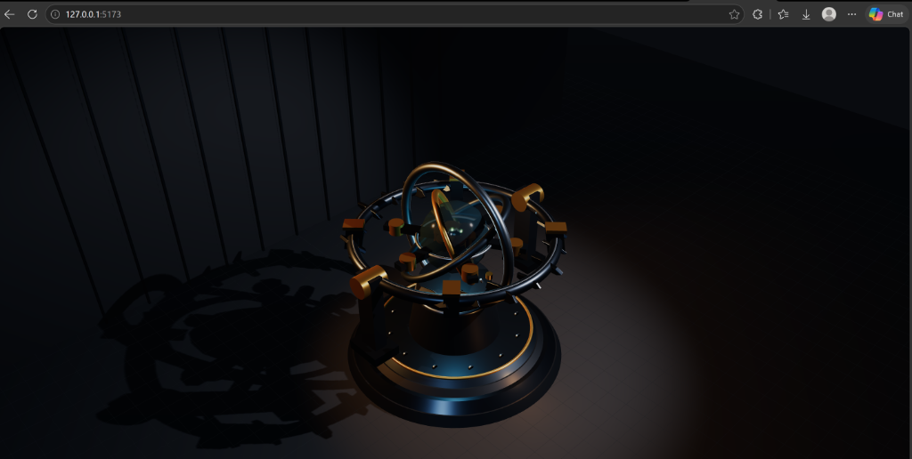
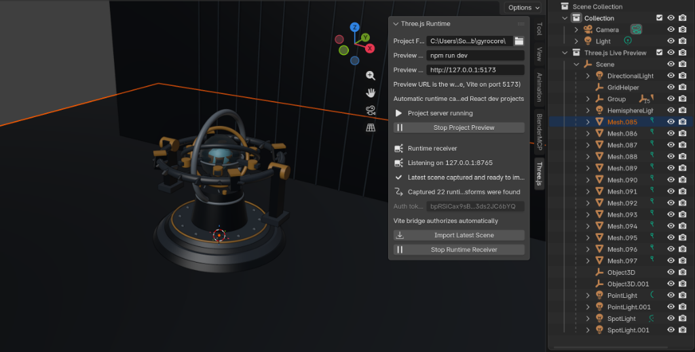

# Three.js to Blender

> **0 to 3D in Blender: One-click drop-in bridge to import AI-generated browser Three.js scenes into Blender as editable 3D objects.**

[](https://www.blender.org/)
[](https://threejs.org/)

| 🌐 1. AI WebGL Generation (`http://127.0.0.1:5173`) | 🧊 2. 1-Click Editable 3D Objects in Blender |
| :---: | :---: |
|  |  |

---

## 💡 Abstract

AI web tools (Claude, ChatGPT, v0, Bolt, Lovable, Cursor) output **procedural Three.js JavaScript code**. Because objects (`BoxGeometry`, `SphereGeometry`, parametric surfaces) exist only dynamically in WebGL memory, **they cannot be right-clicked or saved as 3D mesh files (`.gltf` / `.obj`) out of the box.**

This extension is a **zero-code drop-in bridge**. It automatically hooks your local web dev server, captures live WebGL scenes, canonicalizes procedural geometry into raw `BufferGeometry` attributes, and imports everything into Blender with 1 click.

---

## 🚀 0 to 3D in Blender Workflow

Going from an AI prompt in your browser to a fully editable 3D scene in Blender requires zero code modifications:

### Step 1: Prompt AI to Generate a Procedural Three.js Scene

Ask your favorite AI tool to build a modern 3D WebGL application:

<details open>
<summary>🔍 <b>Example AI Prompt Instance</b></summary>

```text
Create a polished static Three.js 3D object/scene that can be previewed immediately and run locally.

Requirements:
- Use Three.js with clean, production-quality code.
- Build the object procedurally from geometry/materials — no external 3D assets.
- Visually interesting, detailed, modern, and well-composed.
- Dark neutral background with professional lighting, soft shadows, and good depth.
- Object centered in frame and properly scaled.
- Add OrbitControls for mouse rotate/zoom/pan, but no automatic rotation or animation.
- Responsive full-window canvas.
- Prefer a simple Vite + Three.js structure with package.json, index.html, and src/main.js.
- Must work with: `npm install` and `npm run dev`.
```
</details>

### Step 2: Zero-Code Drop-In Live Sync (Blender UI)

No manual JS code setup required—the extension automatically injects a runtime preview bridge into Vite, Next.js 15.3+, and Create React App projects:

1. **Open Sidebar**: In Blender's 3D View, open the Sidebar (`N` key) and select the **Three.js** tab.
2. **Set Project Folder**: In the **Three.js Runtime** panel, click the folder icon next to **Project Folder** and select your WebGL app directory.
3. **Start Live Preview**: Click **▶ Start Project Preview**. Blender launches your dev server (`npm run dev`) and attaches the WebGL listener hook.
4. **Import Scene**: Once rendered in your browser, click **📥 Import Latest Scene**. Your WebGL elements instantly populate Blender under the **Three.js Live Preview** collection as native, editable 3D meshes!

---

## 🎛️ UI & Button Reference

- **Three.js Sidebar Tab**: Access via 3D View > Sidebar (`N` key) > **Three.js**.
- **Three.js Runtime Panel**:
  - **Project Folder**: Path to your local Three.js / Vite web application.
  - **Preview Command**: Local server launcher (defaults to `npm run dev`).
  - **Preview URL**: Development web URL (e.g. `http://127.0.0.1:5173`).
  - **▶ Start Project Preview**: Boots your dev server and attaches the WebGL runtime hook.
  - **📥 Import Latest Scene**: Builds captured WebGL geometry & materials as Blender objects.
  - **⏸ Stop Project Preview**: Terminates the active dev server process.
  - **⏸ Stop Runtime Receiver**: Closes the local HTTP port listener (`127.0.0.1:8765`).
- **File > Import > Three.js JSON (.json)**: Imports exported JSON scene snapshots directly from disk.

---

## ✨ Features

- 🧊 **Procedural Mesh Conversion**: Converts `BoxGeometry`, `SphereGeometry`, lines, and point clouds into native Blender polygon meshes.
- 🎨 **PBR & Texture Translation**: Rebuilds Principled BSDF shaders, emissive glows, roughness, metallic properties, and base64 embedded textures.
- 🎬 **Motion & Animation Capture**: Samples live transform movement over a rolling window (up to 24s) into looping Blender Action keyframes.
- 🎥 **Camera & Lighting Alignment**: Automatically converts Y-up WebGL coordinates to Z-up Blender space while preserving light types and camera projections.

---

## 🛣️ Roadmap

- [x] **Procedural Geometry to Mesh** (Canonical `BufferGeometry` conversion)
- [x] **Live Dev Server Bridge** (Vite, Next.js, CRA zero-code hook)
- [x] **Transform Motion Sampling** (24s keyframe loop capture into Blender Actions)
- [ ] 🦴 **Armature & SkinnedMesh Import** (Skeletal rigging & bone weight translation)
- [ ] 🎭 **Morph Targets & Shape Keys** (Blendshape animation support)
- [ ] 🎨 **Complex GLSL to Shader Nodes** (Full node graph reconstruction for custom shaders)
- [ ] ⚡ **WebGPU & TSL Support** (Three.js Shading Language material parsing)
- [ ] 🌊 **InstancedMesh & Particle Systems** (Bake instanced objects into Geometry Nodes)

---

## 📦 Installation

1. Download or package the extension archive `three-js-to-b3d-v1.21.zip`.
2. Open Blender 4.2 or later.
3. Go to **Edit > Preferences > Extensions > Install from Disk** (top-right menu).
4. Select the `.zip` file and enable **Three.js JSON Importer**.

---

## 📄 License

Distributed under the MIT License. See `LICENSE` for details.
